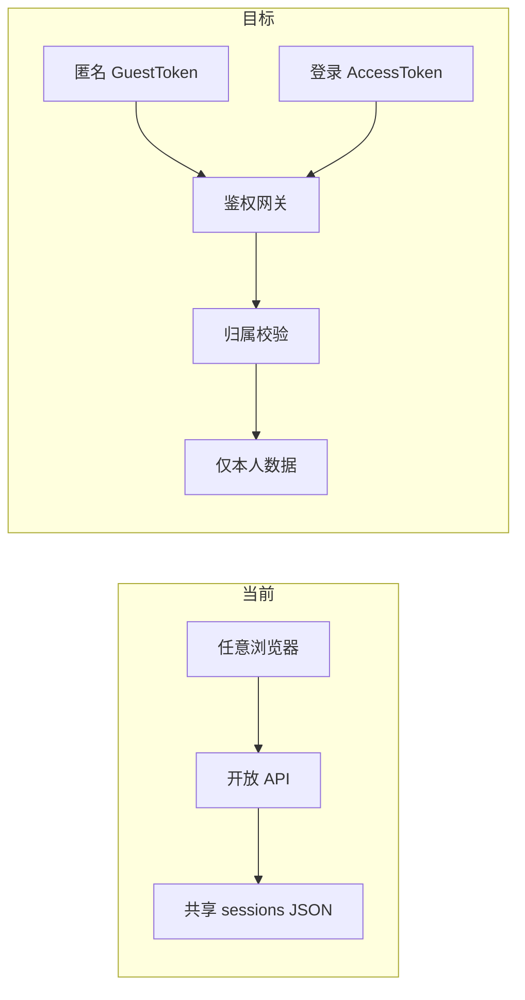
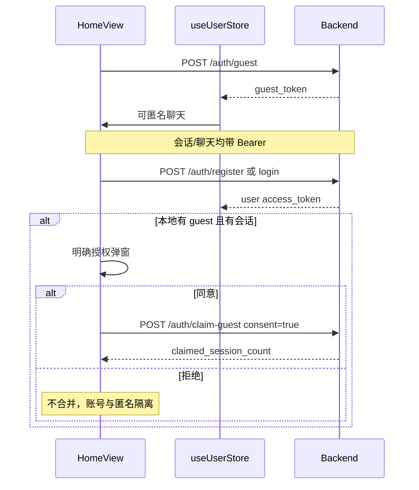

# V1.0.1 账号与用户隔离：访问设计与实现计划

> 版本：1.0.1  
> 日期：2026-08-11  
> 对应路线图：[`plan.md`](../plan.md) 第一阶段 P0「账号与用户隔离」  
> 产品决策：用户名 + 密码；允许匿名聊天；匿名数据升级须明确授权（1B / 2A）

## 1. 目标与验收

| 目标 | 说明 |
| --- | --- |
| 用户识别 | 引入 `user_id` / `guest_id`，注册登录 |
| 会话归属 | 每个会话仅属一个主体；列表与读写均按所有者过滤 |
| 鉴权 | 除 `/health` 外业务接口需 Bearer Token |
| 匿名升级 | 注册/登录后弹窗明示，同意才 `claim-guest` 合并 |

验收用例：

1. 用户 A 无法通过枚举 `session_id` 读到 B 的会话（404）
2. 匿名建会话 → 注册 → 拒绝授权 → 登录后列表不含匿名会话；匿名 token 仍可见原会话
3. 匿名建会话 → 登录 → 同意 claim → 会话出现在用户列表；原 guest token 失效
4. 同账号另一浏览器可恢复已 claim 的会话
5. `/sessions` 无 Token 时 401

## 2. 身份模型

| 主体 | ID | 凭证 | 能力 |
| --- | --- | --- | --- |
| 匿名访客 | `guest_id`（UUID） | Guest JWT，本地持久化 | 创建/读写/删除自己的会话；发消息 |
| 正式用户 | `user_id`（UUID） | Access + Refresh JWT | 同上，跨端恢复 |
| 未持证 | 无 | 无 | 仅 `GET /health` |

规则：

1. 会话所有者：`owner_type ∈ {guest, user}` + `owner_id`
2. 越权 → **404**（不暴露存在性）
3. 无「全局扫盘」列表；无主 JSON 会话语义废弃

## 3. 数据表

- `users`：`id, username(unique 小写), password_hash, created_at, status`
- `guests`：`id, created_at, claimed_at, claimed_by_user_id`（claim 后 Guest JWT 失效）
- `auth_sessions`：`id, user_id, refresh_jti, expires_at, revoked_at`
- `chat_sessions`：`id, owner_type, owner_id, name, personality, created_at, updated_at`
- `messages`：`id, session_id, role, content, created_at`（或按 turn 存 question/answer）
- `consent_logs`：`user_id, guest_id, consented_at, session_count, client_meta`

存储：SQLite（Alpha）+ SQLAlchemy；访问层直接写库，不在 JSON 上做伪多租户。  
历史 `back/sessions/*.json` 不自动保留为无主数据（可另跑迁移脚本，本版默认丢弃共享语义）。

## 4. 鉴权机制

- 密码：`bcrypt` 哈希
- Token：`Authorization: Bearer <token>`
  - Access 载荷：`{ sub, typ: "user"|"guest", jti, exp }`；user 2h，guest 30d
  - Refresh（仅 user）：14d，服务端可吊销；登出吊销
- `POST /auth/guest`：无证签发；已有有效 Guest 则幂等返回
- CORS：白名单；同域 `/api` 用 Header，不用 Cookie 会话

依赖：

- `get_principal()` → `Principal(type, id)`，无效 → 401
- `require_session_owner(session_id, principal)` → 404 if mismatch

## 5. API 契约

### 5.1 认证

| 方法 | 路径 | 鉴权 | 说明 |
| --- | --- | --- | --- |
| POST | `/auth/guest` | 无 / 续期 Guest | `{ guest_token, guest_id }` |
| POST | `/auth/register` | 无 | `{ username, password }` → tokens + user；**不自动合并** |
| POST | `/auth/login` | 无 | 同上 |
| POST | `/auth/refresh` | Refresh | 换发 Access |
| POST | `/auth/logout` | Access 或 Refresh | 吊销 Refresh |
| GET | `/auth/me` | User 或 Guest | 当前主体 |
| POST | `/auth/claim-guest` | **User** Access | `{ guest_token, consent: true }` |

约束：用户名 3–32 `[A-Za-z0-9_]`，大小写不敏感唯一；密码 ≥8。  
登录失败统一 401「用户名或密码错误」；注册冲突 409。

### 5.2 claim-guest

1. 校验 User Access + 解析 guest_token
2. `consent !== true` → 400
3. 事务：guest 下会话 `owner` 改为当前 user；写 `consent_logs`；标记 guest claimed
4. 返回 `{ claimed_session_count }`

拒绝合并：不调接口；保留本地 guest 与账号数据隔离；UI 以登录态浏览账号会话。

### 5.3 会话 / 聊天（均需 Principal）

| 方法 | 路径 | 行为 |
| --- | --- | --- |
| GET | `/sessions` | 仅当前 owner |
| POST | `/sessions` | 写入 owner |
| GET/DELETE | `/sessions/{id}` | 归属校验，失败 404 |
| POST | `/chat` | 先归属再 SSE / 落库 |

SSE 须带同一 `Authorization`。

## 6. 前端访问流

落地：

- `front/src/utils/request.js`：注入 Bearer；401 清登录态并确保 guest
- `front/src/store/index.js`：持久化 access / refresh / guest / userInfo
- 侧栏登录注册入口；启动自动 `POST /auth/guest`
- SSE 与 axios 共用取 token（优先 user access，否则 guest）

## 7. 错误码

| 场景 | HTTP |
| --- | --- |
| 未带/无效 Token | 401 |
| 越权会话 | 404 |
| 注册冲突 | 409 |
| claim 未 consent | 400 |
| guest 已合并或无效 | 409 / 401 |
| 登录注册限流 | 429 |

## 8. 与相邻 P0 边界

- **本版交付**：身份、鉴权、归属、claim、前后端接入、SQLite 落库
- **后续**：生产级 DB/备份、账号注销级联、内容安全、埋点

## 9. 实现清单

- [x] 数据模型与 SQLite 初始化（`back/models.py` / `back/db.py`）
- [x] `/auth/*` 与 JWT 依赖（`back/routers/auth.py` / `back/auth/`）
- [x] `/sessions`、`/chat` 归属校验（`back/session_service.py`）
- [x] `/auth/claim-guest`
- [x] 前端 token / guest / 登录注册 / 授权弹窗 / SSE 鉴权

## 10. 本地运行注意

- 后端请使用 `back/.venv`：`cd back && .venv/bin/python main.py`
- 需配置 `JWT_SECRET`（见 `.env.example`）；开发可用默认值
- 会话改存 SQLite：`back/data/ai_partner.db`；旧 `sessions/*.json` 不再被读取
